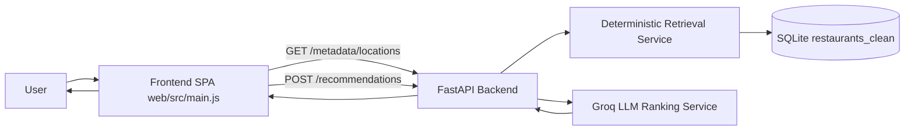

# Project Handoff - Restaurant Recommender

## 1) What this project does

`restaurant_recommender` is an AI-assisted restaurant discovery product.

It helps a user choose restaurants based on:
- location
- budget
- cuisine preference
- minimum rating
- additional mood/intent preferences (for example: quick service, casual, family-friendly)

The system combines:
- deterministic filtering from a curated SQLite restaurant dataset
- LLM-based re-ranking and natural-language explanations for final recommendations

This document explains the full system for newcomers: frontend, backend, database, APIs, and the exact user/API journey.

---

## 2) High-level architecture

There are 4 main runtime pieces:

1. **Frontend SPA (Vite + vanilla JS)**  
   Path: `web/`  
   Collects user inputs, calls APIs, renders recommendations.

2. **Backend API (FastAPI)**  
   Path: `src/phase_2_retrieval/main.py` and related modules  
   Exposes health, metadata, deterministic retrieval, and UX recommendation endpoints.

3. **Database (SQLite)**  
   Path: `src/phase_1_ingestion/data/restaurants.db`  
   Stores cleaned restaurants in `restaurants_clean`.

4. **LLM provider (Groq API)**  
   Used by backend only.  
   Takes retrieved candidates and returns ranked picks with explanation text.

### Runtime data flow (simple view)



### Deployment architecture

Production keeps the **Vite SPA on Vercel** and the **Python stack (SQLite + retrieval + Groq) on Streamlit/FastAPI**, with one important hosting constraint:

| Layer | Platform | Role |
| ----- | -------- | ---- |
| **Frontend** | [Vercel](https://vercel.com/) | Static build from `web/` (`npm run build` → `web/dist`). `web/vercel.json` enables SPA routing. The browser calls the API using **`VITE_API_BASE`** (set in Vercel project env for build + runtime). |
| **Backend (Streamlit)** | [Streamlit Community Cloud](https://streamlit.io/cloud) or Docker | **`streamlit_app.py`** is the Streamlit-native UI. It calls the same services as FastAPI (`build_recommendation_response`, `get_locations`, …). |
| **Backend (JSON API for Vercel)** | Same repo: **FastAPI** (`src/phase_2_retrieval/main.py`) | Required for the SPA’s `fetch` calls. Must be reachable at the origin set in `VITE_API_BASE`. |

**Why Docker is the default “backend URL”**  
[Streamlit Community Cloud](https://docs.streamlit.io/streamlit-community-cloud) only exposes the Streamlit app process to the internet. There is **no second public port** for FastAPI on the same Cloud deployment, so **`VITE_API_BASE` cannot point at a Streamlit-only URL** and still hit `/health`, `/metadata/locations`, and `POST /recommendations`.  

**Recommended production layout**

1. **Vercel:** Root directory = `web/`. Set **`VITE_API_BASE`** to your backend service URL (no trailing slash), e.g. `https://your-app.fly.dev`.  
2. **Backend:** Build and run the repo **`Dockerfile`**. It starts **nginx** on port **8080**: routes `/health`, `/metadata`, `/recommendations`, `/docs`, etc. to **uvicorn (FastAPI)**; all other paths to **Streamlit** (`streamlit_app.py`). One public URL serves **both** the JSON API (for Vercel) and the Streamlit UI (for browsers opening `/`).  
3. **CORS:** On the container, set **`CORS_ORIGIN_REGEX`** to `https://.*\.vercel\.app` and/or **`CORS_EXTRA_ORIGINS`** to your production Vercel URL so the SPA origin is allowed. Local dev origins remain allowed in code.  
4. **Secrets:** Pass **`GROQ_API_KEY`** (and optional **`DB_PATH`**) into the container. For Streamlit-only Cloud deploys, use **Streamlit secrets** (`GROQ_API_KEY`, optional `DB_PATH`) in `streamlit_app.py`.

**Streamlit Cloud alone**  
You can still deploy **`streamlit_app.py`** to Streamlit Cloud for demos or a Streamlit-only audience. The **Vercel SPA** then needs **`VITE_API_BASE`** pointing at **another** host that runs FastAPI (e.g. a small second service) or you accept using only the Docker combined image for the full split-frontend story.

---

## 3) Codebase map for onboarding

### Backend
- Streamlit entrypoint: `streamlit_app.py` (deploy on Streamlit Community Cloud or behind nginx in Docker)
- App entrypoint: `src/phase_2_retrieval/main.py`
- Health API: `src/phase_0_foundation/api_health.py`
- Deterministic retrieval API: `src/phase_2_retrieval/api_recommendations.py`
- Deterministic retrieval service: `src/phase_2_retrieval/service_retrieval.py`
- UX API (used by SPA): `src/phase_4_api_ux/api_api_ux.py`
- UX orchestration service: `src/phase_4_api_ux/service_api_ux.py`
- LLM service: `src/phase_3_llm/service_llm_recommender.py`
- Config/settings: `src/phase_0_foundation/core_config.py`

### Frontend
- Main HTML shell: `web/index.html`
- Main application logic: `web/src/main.js`
- Styling: `web/src/styles.css`
- Dev proxy config: `web/vite.config.js`

### Data / ingestion
- Ingestion pipeline: `src/phase_1_ingestion/data_ingestion.py`
- Canonical restaurant model: `src/phase_1_ingestion/model_restaurant.py`
- Ingestion script: `scripts/ingest_restaurants.py`
- Dedupe script: `scripts/dedupe_restaurants_db.py`

---

## 4) Backend deep dive

## 4.1 App composition

`main.py` builds one FastAPI app and mounts:
- `GET /health`
- `POST /recommendations/query` (deterministic retrieval endpoint)
- `POST /recommendations` (UX endpoint with LLM re-ranking)
- `GET /metadata/locations`
- static UI at `/ui/*` and fallback homepage `/`

It also enables CORS for local frontend origins:
- `localhost`/`127.0.0.1` on ports `5173` and `4173`

## 4.2 API endpoints and purpose

### `GET /health`
- **Purpose:** liveness check
- **Response:** `{ "status": "ok" }`
- **Used by frontend:** during API base discovery in dev mode

### `GET /metadata/locations`
- **Purpose:** load city dropdown + top cuisine and experience chips
- **Backend behavior:** reads distinct `location_city` values from SQLite and returns predefined top lists
- **Response shape:**
  - `locations: string[]`
  - `top_cuisines: [{value, label, count}]`
  - `top_experiences: [{value, label, count}]`

### `POST /recommendations/query`
- **Purpose:** deterministic recommendations only (no LLM)
- **Request model:** `RecommendationQueryRequest`
- **Response model:** `RecommendationQueryResponse`  
  Includes `applied_filters`, `total_candidates`, `recommendations`, `notes`.
- **Primary use:** backend/service testing and deterministic retrieval access

### `POST /recommendations`
- **Purpose:** UX endpoint used by frontend; deterministic retrieval + LLM re-ranking + AI explanation
- **Request model:** same as `/recommendations/query`
- **Response model:** `UXRecommendationResponse`  
  Includes `request_id`, `applied_filters`, `recommendations` (with `ai_explanation`), `notes`.

## 4.3 Recommendation pipeline logic

For `POST /recommendations`, backend flow is:

1. Validate request with Pydantic model.
2. Expand limit for candidate pool (`max(limit * 4, 20)`).
3. Run deterministic retrieval on SQLite via `query_recommendations`.
4. If zero results, return empty response quickly.
5. If Groq API key is missing, return service error.
6. Call LLM with user preferences + candidate list.
7. Validate and dedupe LLM output.
8. Trim to original requested limit and return final UX response.

### Deterministic retrieval details (`query_recommendations`)

Baseline query filters:
- exact `location_city`
- optional `avg_cost_for_two <= max_budget`
- optional `rating >= min_rating`
- optional cuisine contains (`LIKE` on `cuisines_text`)

Sorting priority:
1. rating desc
2. votes desc
3. cost asc

Constraint relaxation (to avoid empty/sparse results):
1. relax `min_rating` if 0 matches
2. relax `cuisine` if still below requested limit
3. relax `max_budget` if still below requested limit

Relaxation decisions are returned in `applied_filters.relaxed_constraints` and `notes`.

## 4.4 Errors and reliability behavior

- Missing DB file -> 503 with message to run ingestion script.
- Missing `GROQ_API_KEY` for `/recommendations` -> 503.
- LLM response parse/schema failure -> retry once with stricter prompt; then fallback deterministic ranking text.
- Duplicate recommendations are filtered by ID and a secondary signature.

---

## 5) Frontend deep dive

## 5.1 UI structure and view states

The SPA is a single-page app with in-page states:
- `hero` (input form)
- `loading` (skeleton UI)
- `results` (recommendation list + sort/filter chips)

No client-side router is used. State is managed in plain JS object(s), not React/Redux.

## 5.2 Frontend state and payload building

Frontend gathers:
- selected location
- max budget from slider
- selected cuisines (chips + free text)
- min rating
- additional preferences (mood tiles + free text)
- fixed result limit (`10`)

It builds payload:
- `location`
- `max_budget`
- `cuisine` (string or list)
- `min_rating`
- `additional_preferences`
- `limit`

## 5.3 Data fetching strategy

Frontend uses native `fetch` via wrapper `apiFetch`.

API base resolution:
1. If `VITE_API_BASE` is set, use it.
2. In dev mode, probe `/health` on common local ports (`8000`, `8010`, etc.).
3. Else use relative path and rely on Vite proxy.

`web/vite.config.js` proxies:
- `/recommendations`
- `/metadata`
- `/health`

to backend target (`VITE_API_PROXY_TARGET` or `http://127.0.0.1:8000`).

## 5.4 Result interactions

After results render, user can:
- sort locally (`recommended`, `rating`, `cost asc`, `cost desc`) without API call
- click refresh (re-runs `POST /recommendations`)
- click "show similar" (injects cuisine hint and re-runs `POST /recommendations`)

### Recommendation card image strategy

The frontend uses a deterministic and cuisine-aware image selection strategy in `web/src/main.js`:
- card image selection is based on `restaurant_id` hash for stable visual output
- cuisine text is mapped to curated food-only image pools (Indian, Chinese, Italian, Biryani, Desserts, Beverages, Fast Food, Continental, Default)
- each pool contains manually curated food URLs (not open random feeds)
- if a selected image fails to load, a fallback curated food image is applied automatically

This avoids irrelevant/random image results and keeps card visuals food-focused.

---

## 6) Database and ingestion

## 6.1 Database design

- Engine: SQLite (`sqlite3`)
- Configured from `settings.db_path`
- Default path: `src/phase_1_ingestion/data/restaurants.db`
- Main table: `restaurants_clean`

Important columns include:
- `restaurant_id`
- `name`
- `location_city`
- `locality`
- `cuisines`
- `cuisines_text`
- `avg_cost_for_two`
- `budget_band`
- `rating`
- `votes`
- `service_tags`
- `source_dataset`
- `ingest_version`
- `ingested_at`

Indexes include:
- unique business-key index on `(name, location_city, COALESCE(locality, ''))`
- city/rating/budget/cuisines support indexes

## 6.2 Ingestion workflow

Source dataset:
- Hugging Face dataset `ManikaSaini/zomato-restaurant-recommendation`

Pipeline steps:
1. load raw dataset
2. normalize columns and types
3. derive city, cuisine list, service tags, budget band
4. dedupe by business key
5. write to SQLite table `restaurants_clean`
6. generate quality report JSON

Commands:
- `python scripts/ingest_restaurants.py`
- `python scripts/dedupe_restaurants_db.py` (for existing DB cleanup)

---

## 7) User journey with exact API timing

This section is the most important for PM handoff.

## Step A: User opens app

Frontend event:
- app initializes UI widgets and calls `loadLocations()`

API call:
- `GET /metadata/locations`

Why it is called now:
- to populate location dropdown, cuisine options, and experience tiles before search

What frontend does with response:
- injects city options
- updates cuisine/mood options
- keeps hero state visible

Failure behavior:
- shows fallback city message and default chips

## Step B: User fills filters and clicks "Show me great places"

Frontend event:
- `runSearch()` is triggered
- validates `location` (required)

No API call happens if:
- location is empty (inline validation shown)

API call if valid:
- `POST /recommendations`

Request body (example):
```json
{
  "location": "Bangalore",
  "max_budget": 1800,
  "cuisine": ["North Indian", "Biryani"],
  "min_rating": 4,
  "additional_preferences": ["casual", "family-friendly"],
  "limit": 10
}
```

UI during call:
- switch to loading state
- show skeleton cards and dynamic loading message

## Step C: Backend computes recommendations

Internal flow (same request):
1. FastAPI validates input.
2. Retrieval service queries SQLite (`restaurants_clean`).
3. Retrieval may relax strict filters to ensure enough results.
4. LLM service ranks candidates and adds explanation text.
5. Backend dedupes + trims to requested limit.
6. Backend returns final response.

Response body (shortened example):
```json
{
  "request_id": "4c7c6d46-7fcf-4a45-8a3f-335f2e02b196",
  "applied_filters": {
    "location": "Bangalore",
    "max_budget": 1800,
    "cuisines": ["North Indian", "Biryani"],
    "min_rating": 4,
    "relaxed_constraints": ["cuisine"]
  },
  "recommendations": [
    {
      "restaurant_id": "123",
      "restaurant_name": "Spice Courtyard",
      "cuisine": "North Indian, Biryani",
      "rating": 4.3,
      "estimated_cost": 1600,
      "ai_explanation": "Great fit for your family-friendly casual dinner..."
    }
  ],
  "notes": ["We nudged your cuisine preference a bit so we could line up more places you will enjoy."]
}
```

## Step D: Frontend renders results

Frontend behavior:
- render cards and recommendation metadata
- render applied filter chips
- show explanatory banner when filters were relaxed
- enable local sort and follow-up actions

## Step E: User follow-up actions

### Refresh recommendations
- API call: `POST /recommendations` again (same current filters)

### Show similar on a card
- Frontend sets cuisine hint from selected card
- API call: `POST /recommendations` again

### Sort option change
- No API call
- local sort using already loaded result list

---

## 8) API contract reference

## 8.1 Request model (`RecommendationQueryRequest`)

- `location` (required, non-empty string)
- `max_budget` (optional, number > 0)
- `cuisine` (optional, string or string[])
- `min_rating` (optional, number between 0 and 5)
- `additional_preferences` (optional, string[])
- `limit` (optional, int 1 to 20; frontend uses 10)

## 8.2 Response model (`POST /recommendations/query`)

- `applied_filters`
  - `location`
  - `max_budget`
  - `cuisines`
  - `min_rating`
  - `relaxed_constraints`
- `total_candidates`
- `recommendations[]` with `reason_tags`
- `notes[]`

## 8.3 Response model (`POST /recommendations`)

All of above, with UX structure:
- `request_id`
- `recommendations[]` entries include `ai_explanation`

## 8.4 Metadata model (`GET /metadata/locations`)

- `locations[]`
- `top_cuisines[]`
- `top_experiences[]`

---

## 9) Config and environment variables

Main app settings (`core_config.py`):
- `app_name`, `app_env`, `app_debug`, `app_version`
- `app_host`, `app_port`
- `db_path`
- `groq_api_key`
- `groq_base_url`

Important environment values:
- `GROQ_API_KEY` -> required for LLM ranking via `POST /recommendations`
- `DB_PATH` (optional override) -> SQLite file path
- `CORS_EXTRA_ORIGINS` -> comma-separated extra allowed browser origins for FastAPI (production)
- `CORS_ORIGIN_REGEX` -> optional regex for origins (e.g. all `*.vercel.app` previews)
- `VITE_API_PROXY_TARGET` -> frontend dev proxy backend target
- `VITE_API_BASE` -> explicit frontend API base override (required on Vercel for cross-origin API)

---

## 10) Local runbook (new developer)

1. Install Python dependencies:
   - `pip install -r requirements.txt`
2. Create `.env` from `.env.example` and set `GROQ_API_KEY`.
3. Build DB (first time):
   - `python scripts/ingest_restaurants.py`
4. Start backend:
   - `uvicorn src.phase_2_retrieval.main:app --reload`
5. Start frontend:
   - `cd web`
   - `npm install`
   - `npm run dev`
6. Open:
   - frontend: `http://localhost:5173`
   - backend docs: `http://127.0.0.1:8000/docs`

---

## 11) Troubleshooting checklist

### "No cities loaded" on hero
- Check backend is running (`GET /health` returns `ok`)
- Verify proxy target / API base env values
- Confirm CORS origin and backend port

### Card image looks irrelevant or blank
- Hard refresh browser (`Ctrl+F5`) to clear stale URL cache
- Confirm frontend is running the latest `web/src/main.js`
- Check browser console/network for blocked image hosts
- Verify fallback behavior triggers on image load error

### "Database not found" error
- Run `python scripts/ingest_restaurants.py`
- Verify `DB_PATH` points to the generated SQLite file

### `/recommendations` fails with service unavailable
- Verify `GROQ_API_KEY` is set in `.env`
- Check outbound internet access to Groq API

### Empty or weak results
- Check if strict filters force heavy relaxation
- Inspect `applied_filters.relaxed_constraints` and `notes`
- Validate city names exist in DB (`GET /metadata/locations`)

---

## 12) PM-oriented product notes

- The product intentionally blends rules-based relevance (trustworthy baseline) with LLM explanation (better user confidence).
- Retrieval relaxation is a deliberate UX strategy to avoid dead ends while signaling transparency via notes.
- `/metadata/locations` is critical for first impression because it controls discoverability and filter confidence.
- The recommendation endpoint is currently stateless per request (no user profile/history persistence in current version).

---

## 13) What to read next (for deeper maintenance)

1. `src/phase_2_retrieval/service_retrieval.py` (query + relaxation logic)
2. `src/phase_3_llm/service_llm_recommender.py` (prompting, validation, fallback)
3. `web/src/main.js` (full UI logic and API choreography)
4. `src/phase_1_ingestion/data_ingestion.py` (data quality and table construction)

This sequence gives the fastest path from product behavior to implementation details.
